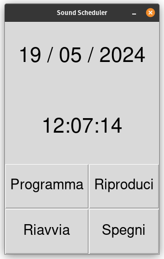
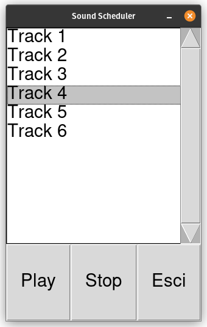
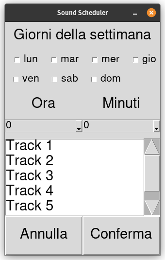

# Pysound Scheduler

This simple program allows you to play sound on demand or scheduling
multiple crontab jobs in specific days of week. This is a first prototype.

I made this tool for run on a Raspberry Pi using a touchscreen to control it.

Actually it don't cares about any other use of crontab for the run user, for simplicity it will empty all task and rewrite crontab with tasks from db only.

## Dependencies

To be able to play MP3 tracks, you have to install mpg123.

### Linux

Install dependencies from repositories

(ex. on Ubuntu based distribution)

``` bash
apt update && apt install -y mpg123
```

### Windows

On windows you can simply download the static 64-bit binary from [here](https://mpg123.de/download/win64/1.32.6/mpg123-1.32.6-static-x86-64.zip), or [here](https://mpg123.de/download/win32/1.32.6/mpg123-1.32.6-static-x86.zip) for the 32-bit version, and put it in the "./tools/" subfolder of the project's root.

```bash
tools/
└── mpg123.exe
```

## Environment variables

| Env Var             | Description          | Default value                     |
| ------------------- | -------------------- | --------------------------------- |
| PYSS_SQLITE_DB_PATH | Sqlite3 DB file path | schedule.db (in program folder)   |
| PYSS_LOG_PATH       | Log file path        | scheduler.log (in program folder) |
| PYSS_LOG_LEVEL      | Define Log level     | info                              |
| PYSS_FULLSCREEN     | Set TK Window in full screen mode | true                 |

## Starting app

```python3
python3 pysound_scheduler.py
```

### Main window



Here we have current date and time, the 

### Internal player frame



Allow manual track play.

You can use the stop button to terminate the current sound play started by schedule.

### Scheduler frame



From here you can schedule track execution. There can be only a single track scheduled in the same day of week at the same hour.

## Next developement steps

- Don't overwrite other crontab jobs not managed by this app
- Language translation
- Includes and installation script to configure all environment from a clean raspbian installation
